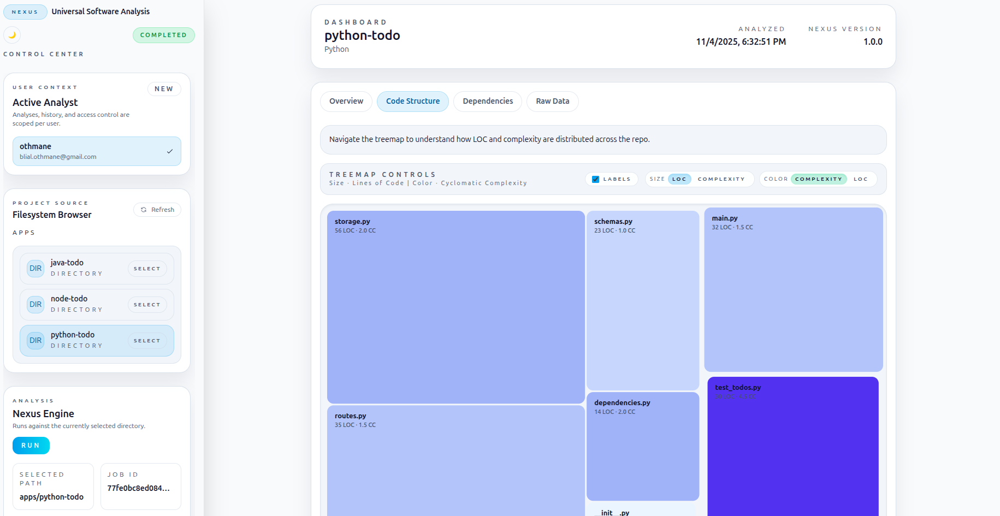

# Nexus

Nexus is a full-stack code intelligence platform. Point it at a project directory and it will crawl the tree, catalogue dependencies, compute static metrics, and preserve a history of every analysis. A FastAPI backend powers the orchestration layer, while a Vue 3 + Tailwind interface gives you an interactive dashboard with filesystem inspection, job status tracking, and lightweight visualisations.

## Why Nexus

- **Cross-language analyzers** – Python, JavaScript/TypeScript, and Java plugins ship out of the box. Each registers against a shared data model so metrics are aligned across ecosystems.
- **Pluggable design** – Drop additional analyzers in `plugins/` or publish them as Python entry points and Nexus will discover them automatically.
- **Actionable telemetry** – Collect line counts, complexity samples, dependency manifests, and structured findings. Export results through the REST API or inspect them inside the UI.
- **History you can query** – Every run is stored via SQLModel so you can compare revisions, trace regressions, or replay old reports.
- **One-command bootstrap** – `./setup.sh` provisions the virtualenv, installs frontend dependencies, builds the dashboard, and launches backend + optional Celery worker.
- **Cloud Run ready** – Dockerfile and `build.sh` ship with the repo so you can containerise and deploy to Google Cloud with a single script.

## System Overview

```
├── backend/                  # FastAPI application, Celery task queue, SQLModel persistence
├── frontend/                 # Vite + Vue 3 dashboard with Tailwind styling
├── plugins/                  # Analyzer implementations (Python, JavaScript, Java)
├── apps/                     # Sample projects available from the filesystem browser
├── Dockerfile                # Multi-stage build for full-stack container
├── build.sh                  # Cloud Build + Cloud Run deployment helper
└── setup.sh                  # Local development bootstrapper
```

## Live Demo

- Frontend & API: [https://nexus-sqhu4om4aq-uc.a.run.app/](https://nexus-sqhu4om4aq-uc.a.run.app/)



### Runtime Topology

```
            ┌────────────┐
            │  frontend  │  Vite dev server (dev) / static assets served by FastAPI (prod)
            └─────┬──────┘
                  │
                  ▼
            ┌────────────┐      Celery (optional)
 requests → │  FastAPI   │ ───────────────► task queue
            │  backend   │ ◄────────────── results + progress updates
            └─────┬──────┘
                  │
                  ▼
            ┌────────────┐
            │ SQLModel   │  persisted analyses, reports, users
            └────────────┘
```

## Prerequisites

- Python 3.11+
- Node.js 20+ and npm (Cloud Run build uses Node 20 LTS)
- Redis (for Celery-backed asynchronous mode)
- Google Cloud CLI + Docker (for container builds / deployments)

## Quick Start (Local)

```bash
git clone https://github.com/OthmaneBlial/nexus.git
cd nexus
cp .env.example .env        # tweak ports, broker, and paths as needed
chmod +x setup.sh
./setup.sh
```

The script performs the following:

1. Creates a project virtualenv under `.venv`.
2. Installs backend requirements and frontend dependencies.
3. Compiles the Vue dashboard.
4. Starts the FastAPI server on `http://localhost:8100`.
5. Launches a Celery worker when a Redis broker is reachable (falls back to inline execution otherwise).

Press `Ctrl+C` to stop both services. Re-run with `./setup.sh --no-install` to skip dependency installs on subsequent launches.

## Manual Workflow

### Backend API

```bash
python -m venv .venv
source .venv/bin/activate
pip install -r backend/requirements.txt
export NEXUS_ALLOWED_ROOT=$(pwd)/apps
uvicorn backend.app.main:app --host 0.0.0.0 --port 8100 --reload
```

The backend exposes:

- `GET /health` – readiness probe
- `GET /api/filesystem` – browsable tree inside the allowed root
- `POST /api/analyze` – trigger an analysis job
- `GET /api/status/{jobId}` – poll job status
- `GET /api/report/{jobId}` – retrieve the final report payload

### Celery Worker (optional but recommended for long analyses)

```bash
celery -A backend.app.tasks.celery_app worker --loglevel=info
```

Set `NEXUS_TASK_MODE=celery` (default) to route jobs through the queue. When Redis is unreachable, the API automatically degrades to inline execution so you can continue testing.

### Frontend Dashboard

```bash
cd frontend
npm install
npm run dev -- --host 0.0.0.0 --port 5173 --strictPort
```

Set `VITE_API_BASE_URL=http://localhost:8100` if you’re hitting the API from a non-default host.

## Configuration Cheatsheet

| Variable | Description | Default |
| --- | --- | --- |
| `API_PORT` | FastAPI HTTP port used by `setup.sh` | `8100` |
| `FRONTEND_PORT` | Vite dev server port | `5173` |
| `NEXUS_ALLOWED_ROOT` | Filesystem root for browsing/analysis | `$(pwd)/apps` (when unset) |
| `NEXUS_TASK_MODE` | `celery` for async queue or `inline` for background tasks | `celery` |
| `NEXUS_CELERY_BROKER` | Redis broker URL | `redis://localhost:6379/0` |
| `NEXUS_CELERY_BACKEND` | Celery result backend | broker URL |
| `NEXUS_DATABASE_URL` | SQLModel connection string | `sqlite+pysqlite:///:memory:` |
| `NEXUS_ALLOWED_ORIGINS` | Optional CORS override for the API | unset |

Create `.env` to persist these between sessions. The backend automatically creates the allowed root directory if it is missing.

## Container Build & Deployment

The repo contains a multi-stage Dockerfile that compiles the frontend, installs backend dependencies, copies bundled sample projects, and serves the stack via Uvicorn.

### Local Build

```bash
docker build -t nexus-local .
docker run --rm -p 8080:8080 nexus-local
```

Visit `http://localhost:8080` to open the bundled dashboard backed by the same container.

### Google Cloud Run

```bash
chmod +x build.sh
PROJECT_ID=<your-gcp-project> REGION=us-central1 ./build.sh
```

The script:

1. Validates `gcloud` authentication and active project.
2. Ensures Cloud Build and Cloud Run APIs are enabled.
3. Submits the container build to Cloud Build.
4. Deploys the resulting image to Cloud Run with sensible defaults (`PORT=8080`, `NEXUS_ALLOWED_ROOT=/workspace/apps`, inline task mode).
5. Prints the publicly accessible service URL.

Override memory/CPU, environment variables, or tags inline:

```bash
PROJECT_ID=my-project \
REGION=europe-west1 \
IMAGE_TAG=$(git rev-parse --short HEAD) \
CLOUD_RUN_ENV_VARS="NEXUS_ALLOWED_ROOT=/workspace/apps,NEXUS_TASK_MODE=inline" \
./build.sh
```

## Sample Projects

The `apps/` directory ships with language-specific todo applications (Python, Node.js, Java). When running locally or on Cloud Run, the filesystem browser defaults to this directory so you always have data to inspect. Upload your own sources by mounting or copying them into the allowed root and rerunning an analysis.

## Testing

```bash
source .venv/bin/activate
pytest backend/tests
npm --prefix frontend test
```

- Backend tests cover API contracts, plugin discovery, and task orchestration helpers.
- Frontend tests use Vitest + Testing Library to verify critical UI flows.

## Troubleshooting

- **Redis not reachable** – set `NEXUS_TASK_MODE=inline` or start a broker locally (`docker run -p 6379:6379 redis`).
- **Port collisions** – export `API_PORT` / `FRONTEND_PORT` before running `setup.sh`.
- **Cloud Run 404 for static assets** – confirm `SERVE_FRONTEND_BUILD=true` (set by default in container) and that the Docker build stage succeeds.
- **File browser empty** – ensure your allowed root contains projects; in Cloud Run, redeploy after adding assets to `apps/` or mount a Cloud Storage bucket via Cloud Run volumes.

## Contributing

We welcome issues, feature requests, and pull requests. Please review our [Code of Conduct](CODE_OF_CONDUCT.md) before contributing and open an issue to discuss substantial changes ahead of time.

## License

This project is licensed under the [MIT License](LICENSE.md). Use it, extend it, and build tools on top of it.
